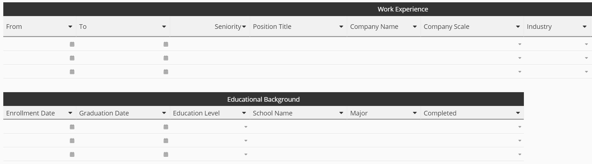

# Proposal for prototype generation

## Introductions

I've spent considerable time re-reading the documents ( a & b ) to come to a proposal on best next steps.
I've canvased the myriad of web sites that provide onboarding features and functionality in order to not re-invent perfectly good working wheels

## Prototype vs MVP (minimum viable product)

Whilst there are multiple definitions of both prototype and MVP, let's agree on the following

### Prototype 
Can be written on back of napkin, can be wire-frames of actual screens, or perhaps a small number of workable web forms.

### Minimum Viable Product
- A first iteration of the completed product, perhaps some actual web forms to traverse so that you can see the proposed operation of the application.
- In the case of the overall Takmeon proposal, the MVP is more like a Minimum Viable Platform, due to the wealth of functionality required to actually run the overall project.

## What ?

## What the application might look like:

### Job Posting Summary
- 

### Job Posting Detail
- 
- 

### New Applicant
- 
- 

### Applicant Interview Details
- 

### Staff Requisition
- 
- 